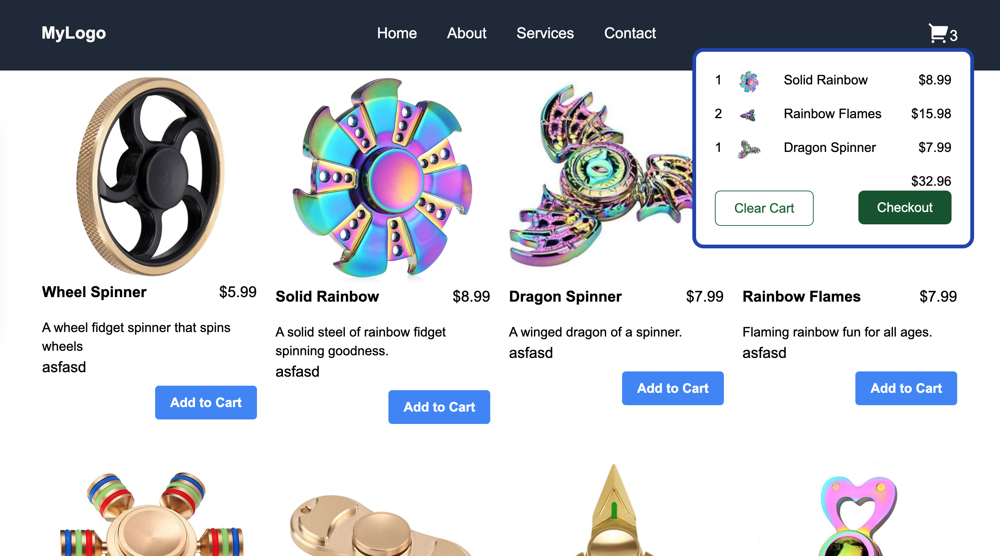

# Microfrontend Application

This repository contains a microfrontend application consisting of four separate apps and a server. Each app is responsible for a distinct part of the overall functionality, and they are integrated to work seamlessly together. The server is written in NestJS and manages the backend operations.

### Mockups

<div>


</div>

## Table of Contents

1. [Applications](#applications)
   - [Host React App](#host-react-app)
   - [Add to Cart SolidJS App](#add-to-cart-solidjs-app)
   - [Cart React App](#cart-react-app)
   - [PDP React App](#pdp-react-app)
2. [Server](#server)
3. [Getting Started](#getting-started)
   - [Prerequisites](#prerequisites)
   - [Installation](#installation)
   - [Running the Applications](#running-the-applications)
4. [Folder Structure](#folder-structure)
5. [Contributing](#contributing)
6. [License](#license)

## Applications

### Host React App

This is the main application that hosts the microfrontends. It integrates the different microfrontend components and renders them as a single application.

### Add to Cart SolidJS App

This microfrontend handles the "Add to Cart" functionality using SolidJS. It allows users to add items to their shopping cart.

### Cart React App

This microfrontend is responsible for displaying the items in the user's cart. It is built using React.

### PDP React App

The Product Detail Page (PDP) microfrontend provides detailed information about a product. This app is also built using React.

## Server

The server is written in NestJS and handles backend operations, including API endpoints for product data, user authentication, and cart management.

## Getting Started

### Prerequisites

Make sure you have the following software installed:

- Node.js (>= 14.x)
- npm (>= 6.x)

### Installation

Clone the repository:

```bash
git clone https://github.com/yourusername/microfrontend-app.git
cd microfrontend-app
```

### Running the Applications

1. **Install dependencies for the server and each application:**

   ```bash
   cd server
   npm install
   cd ../host-app
   npm install
   cd ../addtocart-app
   npm install
   cd ../cart-app
   npm install
   cd ../pdp-app
   npm install
   ```

2. **Start the server:**

   ```bash
   cd server
   npm run start
   ```

3. **Start the host app:**

   ```bash
   cd ../host-app
   npm run start
   ```

4. **Start the Add to Cart app:**

   ```bash
   cd ../addtocart-app
   npm run start
   ```

5. **Start the Cart app:**

   ```bash
   cd ../cart-app
   npm run start
   ```

6. **Start the PDP app:**

   ```bash
   cd ../pdp-app
   npm run start
   ```

By default, the applications will be available at the following URLs:

- Host App: `http://localhost:3000`
- Add to Cart App: `http://localhost:3001`
- Cart App: `http://localhost:3002`
- PDP App: `http://localhost:3003`
- Server: `http://localhost:3004`

## Folder Structure

```
microfrontend-app/
├── server/
│   ├── src/
│   ├── test/
│   ├── .env
│   ├── nest-cli.json
│   └── ...
├── host-app/
│   ├── src/
│   ├── public/
│   ├── .env
│   └── ...
├── addtocart-app/
│   ├── src/
│   ├── public/
│   ├── .env
│   └── ...
├── cart-app/
│   ├── src/
│   ├── public/
│   ├── .env
│   └── ...
├── pdp-app/
│   ├── src/
│   ├── public/
│   ├── .env
│   └── ...
└── README.md
```

## Contributing

Contributions are welcome! Please submit a pull request or open an issue to discuss any changes or improvements.

## License

This project is licensed under the MIT License - see the [LICENSE](LICENSE) file for details.

---

Happy coding! If you have any questions, feel free to reach out.
